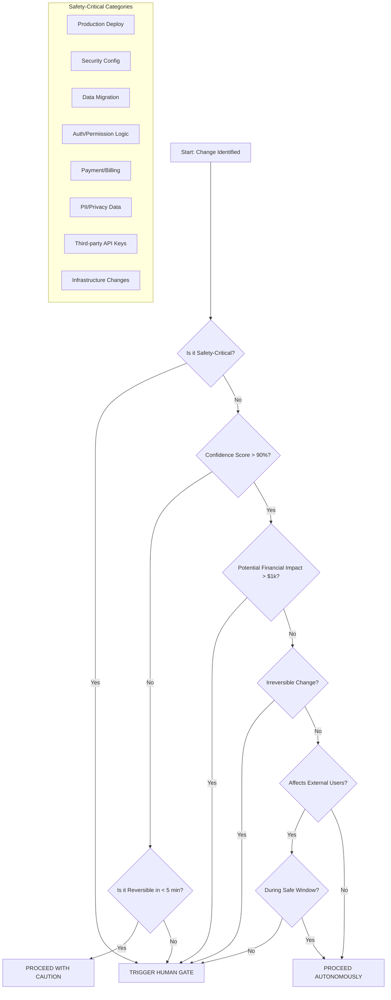

# Human Review Gate (Safety-Critical Operations)

Use this skill whenever work touches ambiguous product calls, high-risk deployments, or stakeholder-sensitive outputs. It packages context like a C-suite briefing so humans can decide fast and safely.

**Core Philosophy:** Autonomy is efficient, but irreversible mistakes are expensive. The goal is maximum velocity with minimum regret.

---

## 1. Decision Tree for Escalation

### Primary Decision Flow

Follow this logic to determine if a human gate is required:



### Quick Reference: Automatic Escalation Triggers

| Category | Always Escalate When... |
|----------|------------------------|
| **Production** | Any deploy to production environment |
| **Security** | Touching auth, permissions, secrets, CORS, CSP |
| **Data** | Schema changes, migrations, bulk deletes |
| **Financial** | Payment logic, pricing, billing integration |
| **Privacy** | PII handling, GDPR/CCPA compliance changes |
| **Infrastructure** | DNS, load balancers, databases, certs |
| **External** | API contract changes, webhook modifications |
| **Compliance** | Audit logs, retention policies, consent flows |

### Confidence Score Calculation

When determining your confidence score (0-100%):

```
Base Confidence = 50%

Add points:
+20% - Clear, unambiguous requirements
+15% - Comprehensive test coverage exists
+10% - Similar change successfully made before
+10% - Change is fully reversible
+10% - Staging environment validated
+5%  - Code review completed

Subtract points:
-20% - Unclear or conflicting requirements
-15% - No test coverage for affected area
-10% - First time making this type of change
-10% - Change affects multiple systems
-10% - Time pressure (deadline < 24h)
-5%  - Working with unfamiliar codebase
```

**Threshold:** If confidence < 90%, escalate to human review.

---

## 2. Risk Scoring Criteria (Impact Risk Score - IRS)

### Primary Risk Matrix (0-25 Scale)

Calculate the **Impact Risk Score (IRS)** before proceeding. Sum the scores (1-5) for each category:

| Category | 1 (Low) | 3 (Medium) | 5 (High) |
|:---------|:--------|:-----------|:---------|
| **Reversibility** | Instant rollback (<5 min) | Complex rollback (requires steps) | Irreversible (data loss possible) |
| **Blast Radius** | Single file/function | Single project/service | Multi-project / Portfolio-wide |
| **User Impact** | Internal/dev only | Subset of users | All users / Public-facing |
| **Financial** | No revenue impact | $100 - $10,000 exposure | >$10k / Revenue-critical path |
| **Security** | Cosmetic/logging only | Access logic / validation | Auth/secrets/PII/compliance |

### Extended Risk Factors (Add to IRS)

| Factor | Points | Applies When |
|--------|--------|--------------|
| **Time Pressure** | +2 | Deadline < 24 hours |
| **Off-Hours** | +2 | Outside safe window (Mon-Thu 09:00-15:00 local) |
| **No Staging Test** | +3 | Change not validated in staging first |
| **Missing Tests** | +2 | No automated tests cover the change |
| **Third-Party** | +2 | Involves external API/service changes |
| **Compliance** | +3 | GDPR/HIPAA/SOC2/PCI implications |
| **First Time** | +1 | Never made this type of change before |

### Escalation Thresholds

| IRS Range | Action | Requirements |
|-----------|--------|--------------|
| **0-7** | ✅ Proceed Autonomously | Log decision in `progress.md` |
| **8-12** | ⚠️ Soft Gate | Notify human, proceed if no response in 15 min |
| **13-17** | 🔶 Human Review Required | Queue for approval, may proceed with explicit sign-off |
| **18-25** | 🛑 **MANDATORY HARD GATE** | Block execution until written sign-off received |

### IRS Calculation Examples

**Example 1: Add logging to internal tool**
- Reversibility: 1 (instant revert)
- Blast Radius: 1 (single file)
- User Impact: 1 (internal only)
- Financial: 1 (no impact)
- Security: 1 (logging only)
- **IRS: 5** → Proceed autonomously

**Example 2: Update user authentication flow**
- Reversibility: 3 (requires coordinated rollback)
- Blast Radius: 3 (auth service)
- User Impact: 5 (all users)
- Financial: 3 (could block signups)
- Security: 5 (auth changes)
- Extended: +2 (no staging test)
- **IRS: 21** → MANDATORY HARD GATE

**Example 3: Database schema migration (add column)**
- Reversibility: 3 (migration rollback needed)
- Blast Radius: 3 (single project)
- User Impact: 1 (transparent to users)
- Financial: 1 (no direct impact)
- Security: 1 (non-sensitive field)
- Extended: +3 (no staging test)
- **IRS: 12** → Soft Gate

---

## 3. Executive Briefing Templates

### Standard Briefing Format

When escalating, provide the following structured data:

```markdown
### 🚨 HUMAN REVIEW REQUIRED: [Action Name]

**Gate Type:** [Hard Gate | Soft Gate | Advisory]
**IRS Score:** [X/25] - [Threshold Level]
**Response Needed By:** [YYYY-MM-DD HH:MM UTC] (or "ASAP" for blockers)
**Priority:** [P0 Blocker | P1 High | P2 Normal | P3 Low]

---

#### 1. TL;DR (30-second summary)
[One paragraph: What needs to happen, why it's risky, what you recommend]

#### 2. The Situation
- **Context:** [1-sentence background]
- **What Changed:** [Specific files/systems affected]
- **Current State:** [e.g., Tests passing, PR ready, staging validated]
- **Blocking:** [What cannot proceed until this is resolved]

#### 3. Risk Assessment

| Risk Factor | Score | Details |
|-------------|-------|---------|
| Reversibility | X/5 | [How hard to undo] |
| Blast Radius | X/5 | [What breaks if wrong] |
| User Impact | X/5 | [Who is affected] |
| Financial | X/5 | [Revenue/cost exposure] |
| Security | X/5 | [Compliance/auth impact] |
| **Extended** | +X | [Time pressure, off-hours, etc.] |
| **TOTAL IRS** | **X/25** | |

**Worst Case Scenario:** [Concrete description of what happens if this goes wrong]
**Likelihood:** [Low | Medium | High] based on [evidence]

#### 4. Mitigation Strategy
- **Pre-execution:** [Backups, snapshots, feature flags]
- **Detection:** [How we'll know if something breaks]
- **Rollback Plan:** [Specific steps, estimated time]
- **Fallback:** [Alternative approach if rollback fails]

#### 5. Recommendation
- **Proposed Action:** [Exactly what you want to do]
- **Rationale:** [Why this is the right approach]
- **Trade-offs:** [What we're accepting]

#### 6. Alternatives Considered

| Option | Pros | Cons | Recommendation |
|--------|------|------|----------------|
| [Option A] | [Benefits] | [Drawbacks] | **Recommended** |
| [Option B] | [Benefits] | [Drawbacks] | Viable fallback |
| [Option C] | [Benefits] | [Drawbacks] | Not recommended |

#### 7. Evidence & Audit Trail
- **Code Changes:** [PR link or diff summary]
- **Test Results:** [Coverage %, specific test output]
- **Staging Validation:** [What was tested, results]
- **Related Issues:** [GitHub issues, tickets]

#### 8. Sign-off Required
- [ ] I understand the risks outlined above
- [ ] I approve proceeding with the recommended action
- [ ] I accept responsibility for this decision

**Approver:** _________________ **Date:** _________________
```

### Quick Briefing Format (IRS 8-12)

For soft gates, use this abbreviated format:

```markdown
### ⚠️ REVIEW: [Action Name] (IRS: X/25)

**What:** [One sentence describing the change]
**Why Flagged:** [Primary risk factor]
**Mitigation:** [Key safeguard in place]
**Recommendation:** [Proceed | Wait | Discuss]

**Auto-proceed in:** 15 minutes (respond to override)
```

### Emergency Briefing Format (P0 Blockers)

For time-critical escalations:

```markdown
### 🔴 URGENT: [Action Name]

**DECISION NEEDED:** [Specific yes/no question]
**DEADLINE:** [Time] - [Consequence of missing deadline]
**IRS:** [Score] | **Risk:** [One-line summary]

**Options:**
1. ✅ APPROVE: [What happens]
2. ❌ REJECT: [What happens]
3. ⏸️ DEFER: [Consequence]

**My Recommendation:** [1/2/3] because [reason]

Reply with number to proceed.
```

## 4. Integration with Approval Queue

All escalations must be logged in the FORGE Approval Queue:

1. **Create Entry:** Write a `.md` file to `.forge_approvals/pending/[TIMESTAMP]_[PROJECT]_[TOPIC].md`.
2. **Update Context:** Set `human_gate: true` in `features.json` if applicable.
3. **Notify:** If a Slack/Notification webhook is configured, trigger it.
4. **Handoff:** The agent must STOP work on this specific path until the file moves to `.forge_approvals/approved/`.

## 5. Scenario-Specific Guardrails

### Scenario A: Production Deployments
- **Check:** Ensure `Lighthouse` performance and `Security` audits are green.
- **Escalate IF:** IRS > 10 OR Deployment happens outside "Safe Window" (Mon-Thu 09:00-15:00).
- **Briefing Focus:** Rollback time and verification steps.

### Scenario B: Security & Auth Changes
- **Check:** Verify against `docs/SECURITY_STANDARDS.md`.
- **Escalate IF:** Modifying `middleware/auth`, `JWT` logic, or `CORS` policies.
- **Briefing Focus:** Compliance impact and potential for privilege escalation.

### Scenario C: Data Migrations
- **Check:** Run on a 10% data sample in staging first.
- **Escalate IF:** Modifying existing schemas with > 1,000 rows OR dropping columns.
- **Briefing Focus:** Backup verification and "Point of No Return" identification.

---
**Protocol:** Never apologize for a human gate. Safety-first is the prime mandate.

