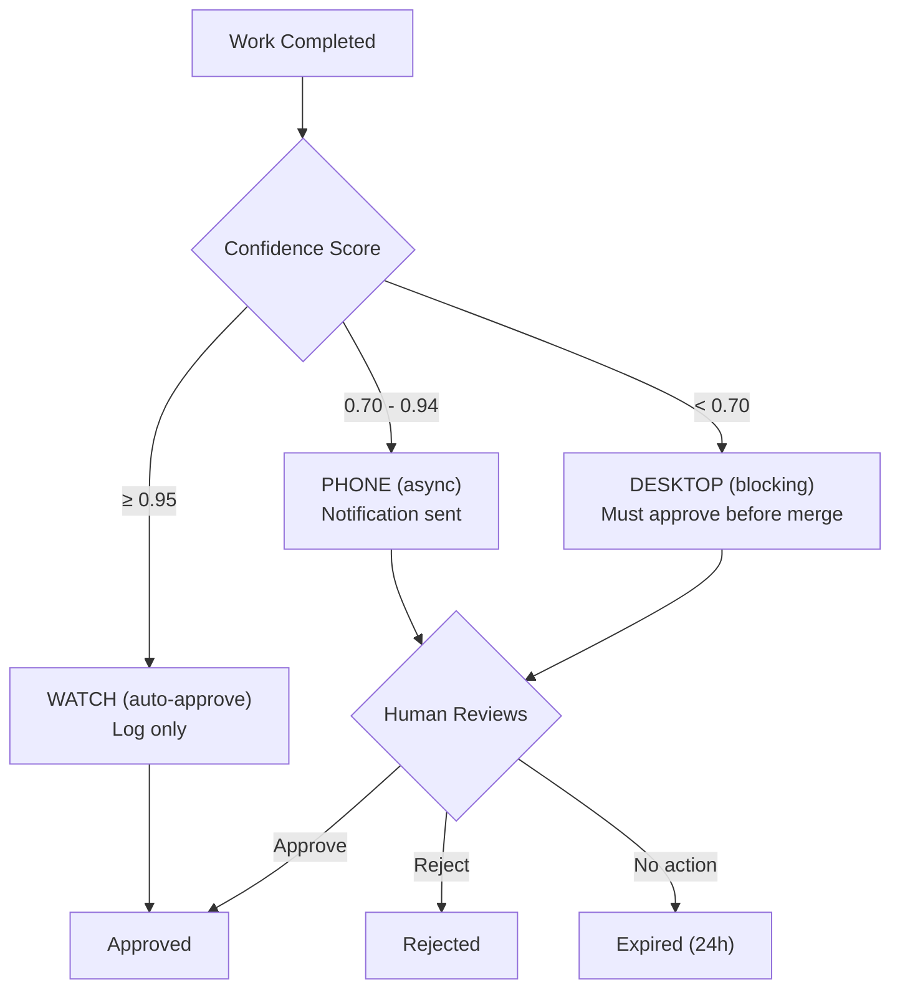

<!-- Owner: prya | Review-after: 2026-06-25 -->
<!-- Trigger: changes to approvals.go or approval-tiers.yaml -->
<!-- Source of truth: cmd/forged/approvals.go -->

# Approval Tier Routing

How the system decides what level of review your work needs.

## Three Systems (Reconciled)

FORGE has three approval/risk concepts that work together:

| System | Location | Purpose |
|--------|----------|---------|
| **Daemon approvals** | `cmd/forged/approvals.go` | Confidence-scored auto-approve for task completions |
| **Human review gate** | `.claude/skills/human-review-gate/SKILL.md` | IRS risk scoring for high-stakes operations |
| **Fleet scaler** | `cmd/forged/fleet_scaler.go` | Agent spawn/tier decisions |

## Approval Types

| Type | Description | Typical Tier |
|------|-------------|-------------|
| `task_completion` | Agent finished a task | Watch (if confidence ≥ 0.95) |
| `merge` | Merge to main | Phone or Desktop |
| `deploy` | Production deployment | Desktop |
| `security` | Auth, secrets, compliance | Desktop |
| `budget` | Cost-affecting changes | Phone |
| `pattern` | New architectural pattern | Phone |
| `lane` | Lane promotion (stage gate) | Watch or Phone |
| `destructive` | Delete, drop, reset | Desktop |

## Tier Routing

## Confidence Scoring Components

The confidence score (0.0 - 1.0) is computed from:

| Component | Weight | What It Measures |
|-----------|--------|-----------------|
| Test coverage on changed files | High | Do tests cover the change? |
| Blast radius | High | How many files/services affected? |
| Reversibility | Medium | Can this be easily undone? |
| Pattern match | Medium | Does it follow an existing pattern? |
| Agent track record | Low | How reliable is this agent historically? |

## What You Should Expect

| Your Work | Expected Tier | Why |
|-----------|--------------|-----|
| Bug fix in existing module, tests pass | Watch | High confidence, low blast radius |
| New endpoint in existing service | Phone | Medium confidence, schema changes |
| New FastAPI service scaffold | Phone → Desktop | Design review required (CLAUDE.md rule 15) |
| Architecture change (new ADR) | Desktop | Council review needed |
| Stripe keys, App Store config | Desktop + Human gate | GATE-level, must have human sign-off |
| `git reset --hard`, drop table | Desktop | Destructive, irreversible |

## Related Docs

- **Approvals code:** `cmd/forged/approvals.go`
- **Tier config:** `config/dark-factory/approval-tiers.yaml`
- **Human review skill:** `.claude/skills/human-review-gate/SKILL.md`
- **Design review:** `.forge/dispatch-templates/design-review.md`
