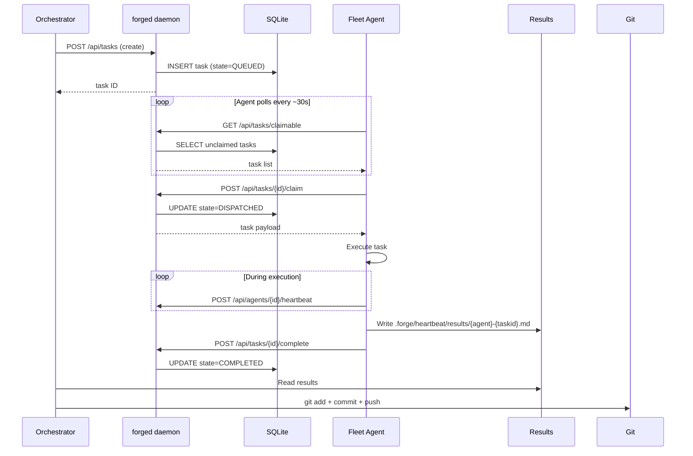
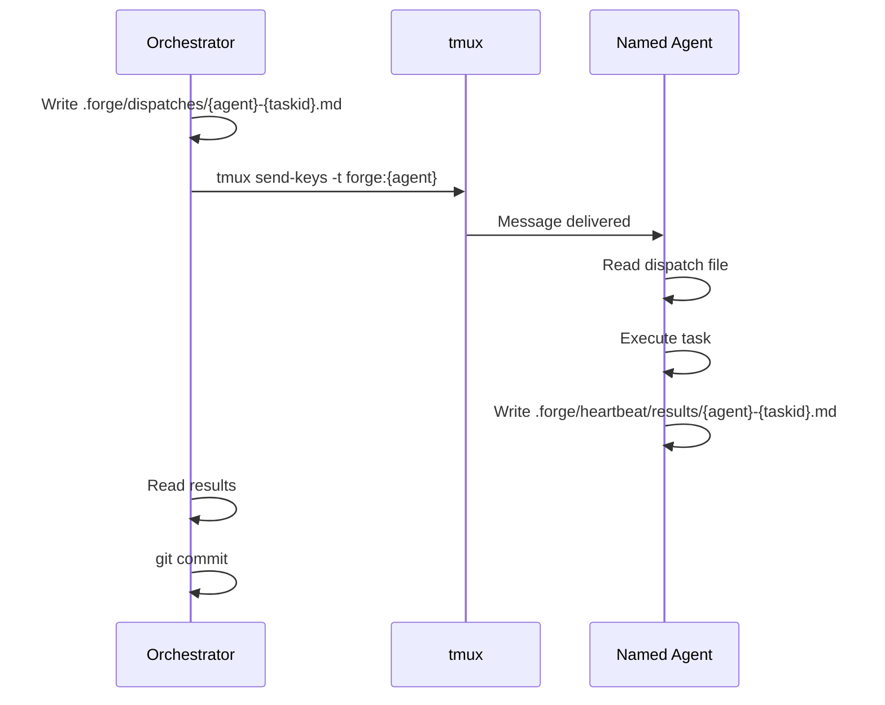
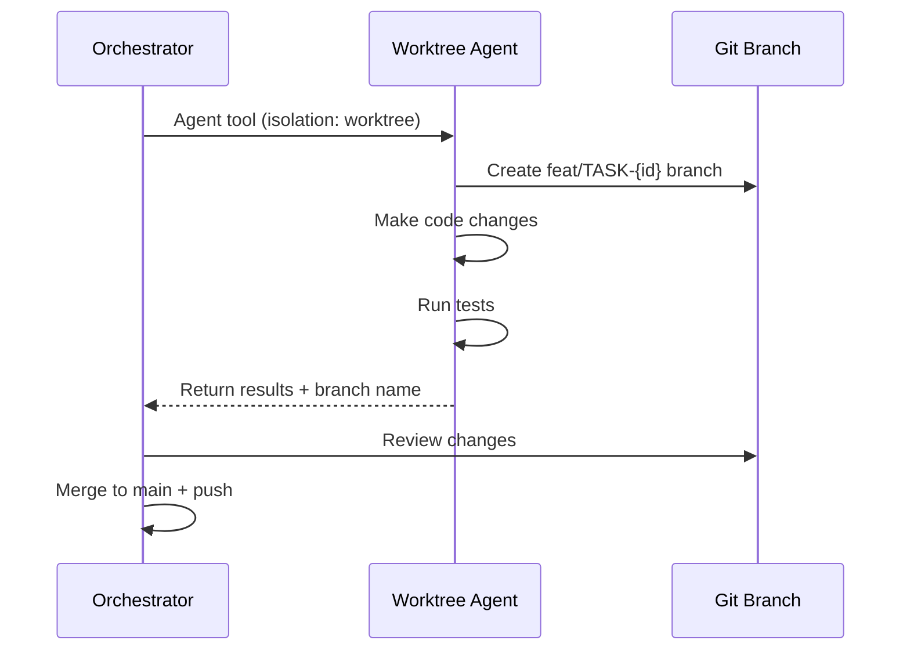

<!-- Owner: prya | Review-after: 2026-06-25 -->
<!-- Trigger: changes to dispatch.go or handlers_task.go -->
<!-- See also: MULTI_AGENT_ORCHESTRATION.md, forge-shared/modules/dispatch-decision.md -->

# Dispatch Flow

How tasks move from orchestrator intent to agent execution to committed results.

## Primary Flow: Queue-Based (99% reliable)

## Secondary Flow: Direct Dispatch (specific agent needed)

## Worktree Flow: Code Changes (100% reliable)

## Dispatch Decision Tree

| Task Type | Method | Reliability |
|-----------|--------|-------------|
| Routine fleet work | Queue (`forge task create`) | ~99% |
| Code changes | Worktree (`Agent` tool) | 100% |
| Named agent override | `forge dispatch send forge:AGENT` | ~95% |
| Research/analysis | Queue or direct dispatch | ~99% |

## Related Docs

- **Dispatch decision module:** `forge-shared/modules/dispatch-decision.md`
- **Task FSM:** `docs/architecture/TASK-FSM.md`
- **System map:** `docs/architecture/SYSTEM-MAP.md`
- **Agent orchestration:** `docs/architecture/MULTI_AGENT_ORCHESTRATION.md`
