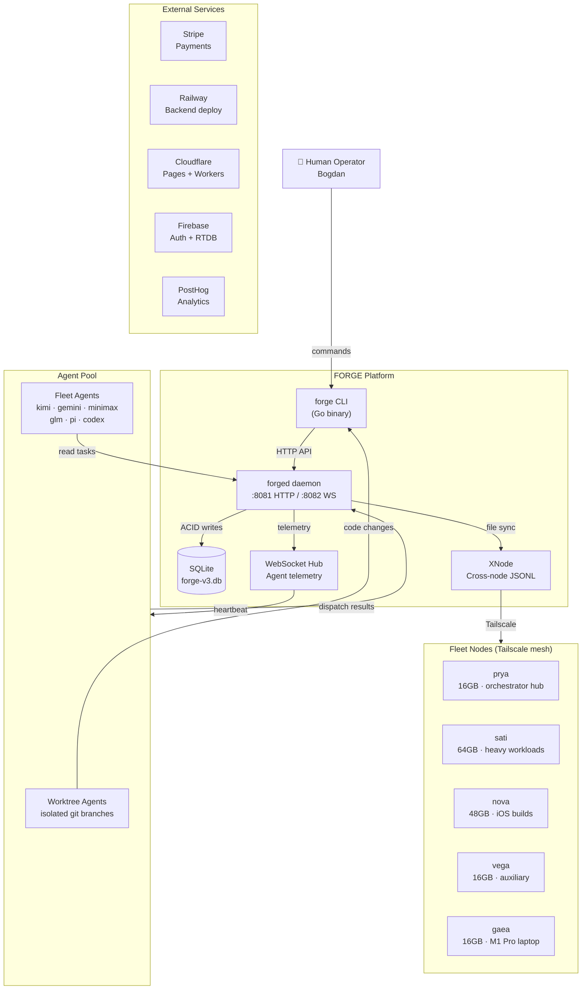

<!-- Owner: prya | Review-after: 2026-06-25 -->
<!-- Trigger: changes to cmd/forge/ or cmd/forged/ -->
<!-- See also: V3_ARCHITECTURE.md for prose details -->

# FORGE System Map

C4 Level 1 (Context) + Level 2 (Container) — how the system fits together.

## Context: Who uses FORGE and what it connects to

## Container Details

| Container | Technology | Purpose | Port |
|-----------|-----------|---------|------|
| `forge` CLI | Go binary (`cmd/forge/`) | All fleet operations | — |
| `forged` daemon | Go binary (`cmd/forged/`) | HTTP API, task queue, patrols | :8081 |
| WebSocket Hub | Go (embedded in forged) | Agent telemetry, heartbeat | :8082 |
| SQLite | `forge-v3.db` | Task state, agent registry, events | — |
| XNode | JSONL files (`.forge/xnode/`) | Cross-node messaging | — |

## Related Docs

- **Prose architecture:** `docs/architecture/V3_ARCHITECTURE.md`
- **Agent orchestration:** `docs/architecture/MULTI_AGENT_ORCHESTRATION.md`
- **Agent FSM:** `docs/architecture/NODE-LEAD-FSM.md`
- **Task lifecycle:** `docs/architecture/TASK-FSM.md`
- **Dispatch flow:** `docs/architecture/DISPATCH-FLOW.md`
