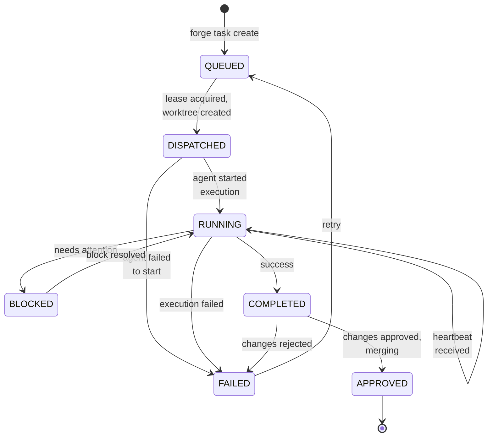

<!-- Owner: prya | Review-after: 2026-06-25 -->
<!-- Trigger: changes to task_state_machine.go or queue.go -->
<!-- See also: NODE-LEAD-FSM.md for agent-side FSM -->
<!-- Source of truth: cmd/forged/task_state_machine.go (ValidTransitions map) -->

# Task Lifecycle FSM

Per ADR-028, every task has two parallel status fields:
- `state` (FSM): `QUEUED` → `DISPATCHED` → `RUNNING` → `COMPLETED` → `APPROVED`
- `status` (legacy): `requested` → `queued` → `assigned` → `executing` → `completed`

Both are written on every transition. The FSM (`state`) is authoritative.

## State Machine

## State Descriptions

| State | Meaning | Next States |
|-------|---------|-------------|
| `QUEUED` | Task created, waiting for agent | DISPATCHED |
| `DISPATCHED` | Agent claimed, worktree created | RUNNING, FAILED |
| `RUNNING` | Agent actively working | RUNNING (heartbeat), BLOCKED, COMPLETED, FAILED |
| `BLOCKED` | Agent stuck, needs help | RUNNING |
| `COMPLETED` | Work done, pending review | APPROVED, FAILED |
| `APPROVED` | Changes merged (terminal) | — |
| `FAILED` | Task failed | QUEUED (retry) |

## Key Implementation Files

- State machine: `cmd/forged/task_state_machine.go`
- Task store: `cmd/forged/task_store.go`
- Task handlers: `cmd/forged/handlers_task.go`
- Tests: `cmd/forged/task_state_machine_test.go`

## Related Docs

- **ADR:** `docs/adr/ADR-028-task-state-machine.md`
- **Agent FSM:** `docs/architecture/NODE-LEAD-FSM.md`
- **System map:** `docs/architecture/SYSTEM-MAP.md`
