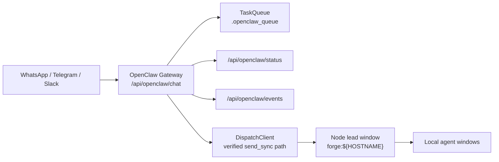
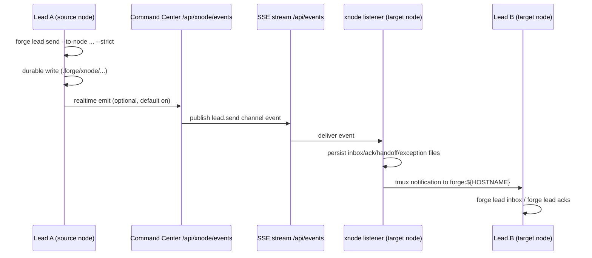

# FORGE Canonical Workflow (Humans + Agents)

**Status:** Canonical as of 2026-02-24 (UTC)
**Scope:** OpenClaw -> lead orchestration, multi-node messaging, active `forge` CLI control plane, flywheel operations, portfolio operating loop

This is the single source of truth for day-to-day operations.
For lead-to-`prya` messaging specifics, use `/Users/bogdan/work/FORGE/docs/runbooks/PRYA_LEAD_XNODE_WORKFLOW.md`.
For control plane objectives and success metrics, use `/Users/bogdan/work/FORGE/docs/runbooks/CONTROL_PLANE_OBJECTIVES.md`.

## 1. Operating Defaults

1. Use the active `forge` CLI first.
2. Use `forge dispatch send` for local agent messaging.
3. Use `forge lead ...` and `forge xnode ...` for cross-node communication.
4. Do not use raw `tmux send-keys` for task delivery.
5. Agent startup mode should be **YOLO/danger mode by default**, unless the task explicitly requires approval-gated execution.
6. Before starting net-new MVP work, check `forge portfolio status` and advance an existing product unless there is a clear validation reason not to.

Current startup command defaults in code:
- `claude`: `claude --dangerously-skip-permissions`
- `codex`: `codex --dangerously-bypass-approvals-and-sandbox`
- `gemini`: `gemini --yolo`
- `opencode`: `opencode --dangerously-skip-permissions`
- `kimi/glm/minimax`: `kimi --agent`

## 2. Topology (Current)

Source: `.forge/heartbeat/nodes/*.json` and `forge` CLI codepaths.

| Node | Role | Notes |
|---|---|---|
| `prya` | Main lead + Command Center backend | SSE/event hub + xnode bridge |
| `nova` | Primary local dev/iOS-capable node | Local lead window: `forge:nova` |
| `sati` | Linux workhorse node | Backend/test-heavy capacity |
| `code-vega` | Auxiliary node | Overflow/secondary capacity |

Lead window convention on every node: `forge:${HOSTNAME}`.

## 3. OpenClaw -> Lead Interaction

Current behavior:
- OpenClaw routes are registered in webhook server startup.
- OpenClaw dispatch uses `forge_harness.fleet.dispatch_client.send_sync(...)` through `openclaw_gateway.py`.
- Compatibility helper names still mention tmux in a few code paths, but delivery is no longer raw `tmux send-keys`.
- Main-node interaction rule: OpenClaw on `prya` should route orchestration work to `forge:prya`, then `forge:prya` fans out cross-node work through `forge lead send`.

## 4. Cross-Node Communication Model

Canonical commands:
- `forge lead preflight --to-node <node>`
- `forge lead send --strict` (default for cross-node directives)
- `forge lead inbox|ack|acks|pending-acks`
- `forge lead handoff create|accept|list`
- `forge xnode relay --exception`
- `forge xnode listen`
- `forge xnode list`

Primary event types:
- `lead.send`
- `lead.ack`
- `lead.handoff`
- `xnode.relay.exception`

Canonical storage (active code path):
- `.forge/xnode/lead-inbox/`
- `.forge/xnode/handoffs/`
- `.forge/xnode/acks/`
- `.forge/xnode/exceptions/`
- `.forge/xnode/realtime-outbox/`

## 5. Active CLI Surface

Top-level control-plane groups in active use:
- Orchestration: `dispatch`, `fleet`, `lead`, `xnode`, `nodes`, `status`, `doctor`, `work`
- Tasking: `tasks`, `recommend`, `evaluator`, `claims`, `handoff`, `sessions`, `memories`
- Loop/flywheel: `loop` (`run`, `status`, `stop`, `api-start`, `api-status`, `api-pause`, `api-stop`, `api-decisions`)
- Dark Factory controls: `df` (`lanes`, `set-lane-policy`, `audit config|set-rate|queue`, `canary list|create|status|pause|resume|promote|rollback`)

Notes:
- Flywheel operations are currently exposed through `forge loop ...` and API-backed loop subcommands.
- Some historical docs mention loop subcommands that do not exist in current CLI (`scan`, `weekly-scan`). Treat those as stale.

## 6. Power Tools for Flywheel and Fleet

Primary tools (recommended):
- `forge portfolio status`
- `forge portfolio list`
- `forge portfolio show <product>`
- `forge loop run -d <domain> -p <project>`
- `forge loop status -d <domain> -p <project>`
- `forge loop stop -d <domain> -p <project>`
- `forge loop api-*` for Command Center-backed control
- `forge df ...` for lane policy / audit sampling / canary rollout controls (backend-backed)
- `forge recommend task|explain|log|contention`
- `forge evaluator status|results|summary|rerun`
- `forge claims submit|verify|list|stats`
- `forge status --watch` (TUI dashboard)
- `forge fleet status` (Health summary)

Operational wrappers (allowed, secondary):
- `forge bootstrap` (Infrastructure setup)

Compatibility wrappers (legacy, avoid for new workflows):
- `harness/scripts/fleet-watch.sh` (Use `forge fleet status`)
- `harness/scripts/fleet-dispatch.sh` (Use `forge dispatch send`)
- historical `forge-harness ...` command examples in old docs
- retirement/deprecation policy: `/Users/bogdan/work/FORGE/docs/runbooks/LEGACY_TOOLING_POLICY.md`

## 7. Gaps and Opportunities

1. Strict cross-node send wrapper is now available and active docs are lint-guarded.
Action: run `uv run python scripts/check_strict_lead_send_docs.py` in doc updates and migrate any newly promoted docs before they move out of plan/archive status.

2. YOLO-mode normalization is incomplete.
Action: standardize startup defaults for `opencode` and `kimi` paths where safe; keep opt-out for approval-gated tasks.

3. XNode storage has shape drift from older artifacts.
Action: migrate non-canonical files in `.forge/xnode/*` to canonical JSON/JSONL schemas and add validation.

4. Documentation drift is high.
Action: keep this doc as root source and archive/replace stale operational docs.

5. Product-stage gating is now explicit, but not yet wired into dispatch/recommendation.
Action: use `docs/portfolio/portfolio-state.yaml` as the source of truth until routing becomes portfolio-aware.

5. Offline node observability now has an explicit fallback.
Action: use `forge nodes list --offline` during CC outages and keep `.forge/heartbeat/nodes/*.json` fresh on each node.

6. QMD semantic search quality is degraded when embeddings are stale.
Action: include `python scripts/qmd_maintenance.py --skip-embed` in node maintenance cadence, then run embedding maintenance (`python scripts/qmd_maintenance.py`) when model downloads are healthy. Run QMD queries serially (not in parallel) to avoid `SQLITE_BUSY_RECOVERY` lock errors.

## 8. Documentation Contract

When updating operations docs:
1. Update this file first.
2. Keep legacy docs archived under `docs/archive/`.
3. In legacy locations, leave a short pointer to this file.
4. Prefer exact CLI help-verified commands over remembered examples.
5. Run `uv run python scripts/check_strict_lead_send_docs.py` and fix any non-strict lead-send examples.
6. Run `python scripts/check_canonical_docs_policy.py` and remove active legacy CLI/raw tmux dispatch examples (or mark intentional anti-pattern blocks explicitly).

## 9. Human and Agent Quick Start

1. Read this file.
2. Read `/Users/bogdan/work/FORGE/AGENTS.md`.
3. Run `forge status` and `forge fleet status` (fallback: `forge nodes list --offline`).
4. Initialize/confirm node defaults: `forge config rc-init` then `forge config rc-show` (expects `~/.forgerc` on each node with API URL + token).
5. Refresh doc index for agent lookup: `python scripts/qmd_maintenance.py --skip-embed`.
6. Validate control-plane parity before major ops: `python scripts/control_plane_parity_audit.py --api-url <prya-backend-url> --token $FORGE_WEBHOOK_TOKEN`.
7. Dispatch using `forge dispatch send`.
8. For cross-node work, run `forge lead send --strict --to-node <node> ...` and `forge lead ack --require-realtime-delivery`.
9. For portfolio decisions, use `forge portfolio status` and update `docs/portfolio/portfolio-state.yaml` before broadening scope.
