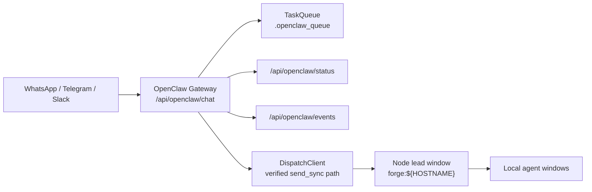
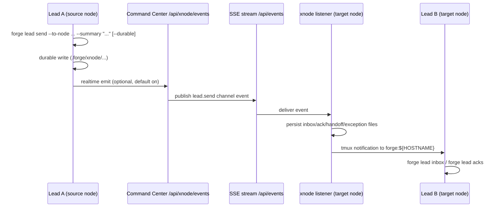

# FORGE Canonical Workflow (Humans + Agents)

**Status:** Canonical as of 2026-04-04 (UTC)
**Scope:** OpenClaw -> lead orchestration, multi-node messaging, active `forge` CLI control plane, flywheel operations, portfolio operating loop

This is the single source of truth for day-to-day operations.
For lead-to-`prya` messaging specifics, use `./docs/runbooks/PRYA_LEAD_XNODE_WORKFLOW.md`.
For control plane objectives and success metrics, use `./docs/runbooks/CONTROL_PLANE_OBJECTIVES.md`.

## 1. Operating Defaults

1. Use the active `forge` CLI first.
2. Use `forge dispatch send` for local agent messaging.
3. Use `forge lead ...` for cross-node directives and `forge node ...` for mesh status/registration. There is **no** top-level `forge xnode` noun — XNode is the API/storage layer used by `lead` and `node`.
4. Do not use raw `tmux send-keys` for task delivery.
5. Agent startup mode should be **YOLO/danger mode by default**, unless the task explicitly requires approval-gated execution.
6. Before starting net-new MVP work, check `forge portfolio status` and advance an existing product unless there is a clear validation reason not to.

Current startup command defaults (see `AGENTS.md` §10 and `cmd/forge/workflow_fleet.go`):
- `claude`: `claude --dangerously-skip-permissions`
- `codex`: `codex --dangerously-bypass-approvals-and-sandbox`
- `gemini`: `gemini -y`
- `kimi`: `kimi -y`
- `pi`: `pi`
- `minimax`: `minimax`
- `glm`: `glm`
- `cursor`: `cursor-agent -f`
- `amp`: `amp --dangerously-allow-all`
- `opencode`: `opencode`
- `kilo`: `kilo`

## 2. Topology (Current)

Source: `.forge/heartbeat/nodes/*.json` and `forge` CLI codepaths.

| Node | Role | Notes |
|---|---|---|
| `prya` | Main lead + Command Center backend | SSE/event hub + xnode bridge |
| `nova` | Primary local dev/iOS-capable node | Local lead window: `forge:nova` |
| `sati` | Linux workhorse node | Backend/test-heavy capacity |
| `code-vega` | Auxiliary node | Overflow/secondary capacity |

Lead window convention on every node: `forge:${HOSTNAME}`.

## 3. OpenClaw -> Lead Interaction

Current behavior:
- OpenClaw routes are registered in webhook server startup.
- OpenClaw dispatch uses `forge_harness.fleet.dispatch_client.send_sync(...)` through `openclaw_gateway.py`.
- Compatibility helper names still mention tmux in a few code paths, but delivery is no longer raw `tmux send-keys`.
- Main-node interaction rule: OpenClaw on `prya` should route orchestration work to `forge:prya`, then `forge:prya` fans out cross-node work through `forge lead send`.

## 4. Cross-Node Communication Model

Canonical commands (verified against `cmd/forge`):
- `forge lead preflight --to-node <node>`
- `forge lead send --to-node <node> --summary "..." [--task-id ...] [--durable]`
- `forge lead inbox`, `forge lead ack <message-id>`, `forge lead acks`
- `forge lead swap --to <harness>` (orchestrator harness hot-swap in tmux)
- `forge node list`, `forge node status <node>`, `forge node join`, … (mesh / `/api/xnode/*` on the daemon)
- `forge relay start|stop|status|deliveries` (dispatch file relay worker — not an xnode subcommand)

There is **no** `forge lead handoff` or `forge xnode` subcommand group in the current Go CLI; handoff files may still live under `.forge/xnode/handoffs/` from daemon/patrol behavior.

Primary event types:
- `lead.send`
- `lead.ack`
- `lead.handoff`
- `xnode.relay.exception`

Canonical storage (active code path):
- `.forge/xnode/lead-inbox/`
- `.forge/xnode/handoffs/`
- `.forge/xnode/acks/`
- `.forge/xnode/exceptions/`
- `.forge/xnode/realtime-outbox/`

## 5. Active CLI Surface

Verified top-level groups in current use:
- Core: `status`, `task`, `agent`, `fleet`, `dispatch`, `daemon`, `node`, `portfolio`, `approval`, `patrol`, `config`
- Cross-node: `lead`
- Hidden but active: `monitor`, `tui`, `dashboard`, `work`, `git`, `context`, `lock`, `state`, `relay`

Notes:
- Root help intentionally hides lower-frequency commands to reduce noise.
- Use `forge advanced --help` to discover hidden but real surfaces.
- Treat docs that center `loop`, `df`, `nodes`, `sessions`, or `memories` as historical until re-verified against current help and code.

## 6. Power Tools for Fleet Operations

Primary tools (help-verified):
- `forge status`
- `forge fleet windows`
- `forge task list|show|create|claim|complete`
- `forge dispatch send`
- `forge lead preflight|send|inbox|ack|acks`
- `forge daemon status|start|restart|stop`
- `forge patrol list`
- `forge portfolio status|list|show`
- `forge monitor`, `forge tui`, `forge dashboard`
- browser UI at `/ui`

Compatibility / legacy surfaces:
- `/dashboard` and `/tui` HTML pages are debug/compatibility views, not the primary browser UI.
- Historical `forge-harness ...`, `forge message ...`, `forge fleet status`, `forge config rc-init`, and `~/.forgerc` examples are stale until reintroduced in code.
- Raw `tmux send-keys` remains compatibility-only for approvals or restarts when the CLI path is unavailable.

## 7. Gaps and Opportunities

1. Config onboarding still has split-brain semantics.
Action: document and gradually simplify the current precedence chain: `FORGE_API_URL` -> `~/.forge/config.toml` -> project `.forge/config.toml` -> project `.forge/forge.yaml`.

2. Browser surfaces are inconsistent.
Action: treat `/ui` as the primary browser UI and clearly label `/dashboard` + `/tui` as compatibility/debug views.

3. Fleet windows and registered/heartbeating agents can diverge.
Action: make onboarding explicit about the difference between tmux presence, daemon registration, and heartbeat freshness.

4. Documentation drift remains the main source of operator error.
Action: keep this file, `AGENTS.md`, and `docs/ACTIVE_SURFACES.md` aligned with `forge --help` plus `forge advanced --help`.

5. QMD searches should stay serialized.
Action: continue using QMD one query at a time to avoid `SQLITE_BUSY_RECOVERY`.

## 8. Documentation Contract

When updating operations docs:
1. Update this file first.
2. Keep legacy docs archived under `docs/archive/`.
3. In legacy locations, leave a short pointer to this file.
4. Prefer exact CLI help-verified commands over remembered examples.
5. Run `uv run python scripts/check_strict_lead_send_docs.py` and fix any non-strict lead-send examples.
6. Run `python scripts/check_canonical_docs_policy.py` and remove active legacy CLI/raw tmux dispatch examples (or mark intentional anti-pattern blocks explicitly).

## 9. Human and Agent Quick Start

1. Read `README.md`, `AGENTS.md`, `docs/ACTIVE_SURFACES.md`, and `docs/AGENT_QUICK_START.md`.
2. Run `forge config list` and confirm the control plane you are actually targeting.
3. Run `forge status`, `forge fleet windows`, `forge task list`, and `forge daemon status`.
4. Use `FORGE_API_URL=http://localhost:8081 forge status` for a one-off local override when project config still points at another hub.
5. Use `/ui` for browser monitoring; treat `/dashboard` and `/tui` as compatibility/debug views.
6. Dispatch local named work with `forge dispatch send`.
7. Dispatch cross-node work with `forge lead send --to-node <node> --summary "..." --durable`.
8. Use `forge advanced --help` if a command seems to be missing from root help.
9. For portfolio decisions, use `forge portfolio status` and `config/portfolio/portfolio-state.yaml` before broadening scope.
