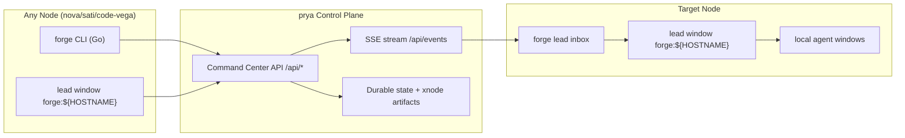

# Prya Lead XNode Workflow

**Status:** Canonical support workflow  
**Updated:** 2026-02-25  
**Primary audience:** Node leads and coding agents operating on `nova`, `sati`, `code-vega`, and `prya`

## 1. Operating Model

Treat FORGE like a control-plane architecture:
- `prya` backend (`/api/*`) is the single source of truth.
- Every node runs `forge` CLI (Go) as the client plane.
- Local agent work stays local (`forge dispatch send`).
- Cross-node coordination uses lead-to-lead channels (`forge lead send`, `forge lead inbox/ack`).



## 2. Required Node Defaults

On each node:

```bash
forge config rc-init \
  --api-url http://100.70.79.45:8080 \
  --api-token <FORGE_WEBHOOK_TOKEN> \
  --node-id "$(hostname -s)"
forge config rc-show
```

Expected `~/.forgerc` keys:
- `FORGE_API_URL`
- `COMMAND_CENTER_URL`
- `FORGE_WEBHOOK_TOKEN`
- `FORGE_NODE_ID`

## 3. Communicating With Prya Lead

### 3.1 Preflight + Send Directive

From any node, send a lead directive to `prya`:

```bash
forge lead preflight --to-node prya
forge lead send \
  --to-node prya \
  --task-id OPS-<id> \
  --summary "Need prya lead action" \
  --priority high \
  --strict
```

`--strict` enforces ack/realtime delivery checks and should be default for cross-node work.

### 3.2 Ack Lifecycle

```bash
forge lead inbox --json
forge lead ack \
  --message-id <MESSAGE_ID> \
  --note "completed or blocked with evidence" \
  --require-realtime-delivery
forge lead acks --json
```

### 3.3 Relay Exception Path (Urgent)

> ⚠️ **NOT YET IMPLEMENTED.** `forge xnode relay --exception` does not exist in the current CLI.
> Use `forge notify telegram "Immediate action required"` for urgent alerts, or use `forge lead send --strict --priority urgent`.

For urgent cross-node unblocks:
```bash
forge lead send \
  --to-node prya \
  --priority urgent \
  --summary "Immediate action required" \
  --strict
forge notify telegram "Urgent: check lead inbox on prya"
```

## 4. Local vs Cross-Node Dispatch Matrix

| Use case | Command |
|---|---|
| Local agent task | `forge dispatch send forge:<agent> "Task: .forge/dispatches/dispatch-*.md"` |
| Cross-node lead directive | `forge lead send --to-node <node> --strict ...` |
| Cross-node ack | `forge lead ack --message-id <id> --require-realtime-delivery` |
| Emergency route | `forge lead send --priority urgent --strict` + `forge notify telegram` |

## 5. Node Health and Data Fidelity

Each node should publish telemetry so the dashboard is not blind:

```bash
forge node status          # Mesh health + ping
forge node list           # All nodes in mesh
forge status              # Fleet health snapshot
```

If dashboard streams look stale:
1. Verify backend first (`/health`, `/api/agents`, `/api/tasks`, `/api/events`).
2. Verify node heartbeat files under `.forge/heartbeat/nodes/*.json`.
3. Use `forge node list` as fallback operator view.

## 6. Non-Negotiables

1. Do not use raw `tmux send-keys` for task dispatch.
2. Use `forge` CLI (Go, `cmd/forge/`) for normal operations; `forge-harness` and `cli_v2` are deleted — iOS harness only via `bin/forge-ios`.
3. Keep cross-node messaging lead-to-lead and durable (`forge lead send --strict --to-node <node>`, `forge lead inbox/ack`).
