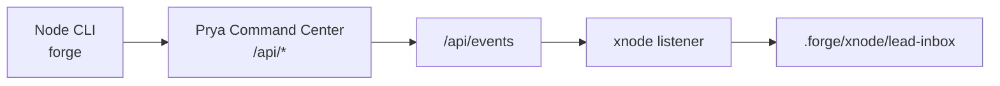

# Agent Packet 01: Bootstrap

Purpose: bring any node online with canonical `forge` CLI v2 control-plane access.

## 1. Required Node Config

Initialize and validate `~/.forgerc`:

```bash
forge config rc-init \
  --api-url http://100.70.79.45:8080 \
  --api-token <shared-token> \
  --node-id "$(hostname -s)"
forge config rc-show
```

If you need manual editing, keep both URL keys aligned:

```bash
# ~/.forgerc
FORGE_API_URL=http://100.70.79.45:8080
COMMAND_CENTER_URL=http://100.70.79.45:8080
FORGE_WEBHOOK_TOKEN=<shared-token>
FORGE_NODE_ID=$(hostname -s)
```

Notes:
1. `~/.forgerc` is canonical.
2. `~/.forcerc` is compatibility fallback only.
3. `forge` CLI v2 autoloads this file at startup and aliases `FORGE_API_URL` <-> `COMMAND_CENTER_URL`.
4. Shell env vars override rc values.

## 2. Health Checks

```bash
forge doctor
forge status --json
forge status
forge node list
forge lead inbox
```

If `forge status --json` fails:
1. `curl -sS "$COMMAND_CENTER_URL/health"`
2. verify token: `curl -sS -H "Authorization: Bearer $FORGE_WEBHOOK_TOKEN" "$COMMAND_CENTER_URL/api/nodes"`

## 2.1 QMD Readiness

```bash
qmd status
qmd embed --auto
```

Run this after major docs updates so agent semantic search stays aligned with current runbooks.

## 3. Topology Reference


